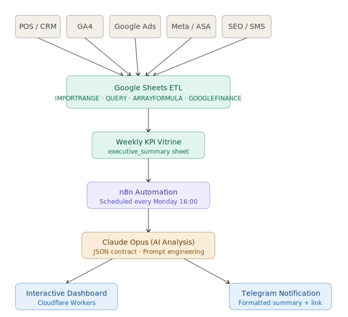
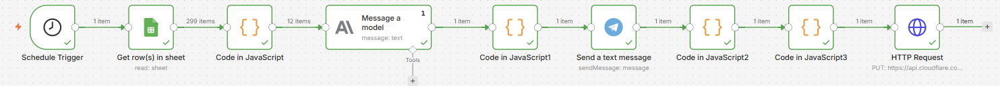

# AI KPI Reporting System

> AI-powered executive reporting platform that consolidates operational, CRM, analytics and marketing data into a unified KPI mart and automatically generates weekly business insights.

---

## Business Problem

A multi-channel restaurant chain generates data across multiple systems, including POS, CRM, advertising platforms, analytics tools, and loyalty programs.

Preparing weekly executive reports required manual data extraction, consolidation, validation and interpretation across multiple sources. The process was time-consuming, difficult to scale and prone to inconsistencies.

---

## Solution

An end-to-end automated reporting platform that runs every Monday and delivers:

* AI-generated executive summaries with key business insights, risks and recommendations
* Interactive dashboards updated automatically
* Structured Telegram notifications for stakeholders
* Centralized KPI reporting based on a unified weekly data model

---

## Outcomes

* ⏱️ Reduced weekly reporting effort from several hours to zero manual work
* 📊 Consolidated data from 10+ independent sources into a single KPI reporting layer
* 🤖 Automated executive analysis and business signal detection using Claude
* 📱 Delivered structured insights automatically every Monday
* 📈 Established a reusable reporting framework for future business intelligence initiatives

---

## Architecture



---

## n8n Workflow

The orchestration layer is implemented in n8n and executes automatically every Monday.

Workflow steps:

1. Read KPI data from Google Sheets
2. Prepare 12-week business context
3. Send structured metrics to Claude
4. Generate executive insights
5. Deliver Telegram summary
6. Build dashboard HTML
7. Publish dashboard to Cloudflare Workers



---

## Data Sources

The reporting layer consolidates data from multiple operational and marketing systems:

### Operational Data

* POS / OLAP sales reporting
* CRM and order management system
* Customer order sources and channel performance

### Analytics Data

* Google Analytics 4 (Web)
* Google Analytics 4 (App)

### Marketing Data

* Google Ads (7 advertising accounts)
* Meta Ads (2 advertising accounts)
* Apple Search Ads
* SEO spend tracking
* SMS / Email marketing spend tracking

### Supporting Data

* USD/UAH exchange rates via Google Finance

All datasets are normalized and aggregated into a unified weekly KPI mart before AI analysis.

---

## ETL Design

Google Sheets is used as a lightweight analytical warehouse and transformation layer.

Data flows through four stages:

```text
Raw Layer
    ↓
Daily Layer
    ↓
Weekly Layer
    ↓
Executive Summary Mart
```

### Key Transformations

* Cross-file imports using `IMPORTRANGE`
* Automated weekly aggregation using `QUERY` and `ARRAYFORMULA`
* Currency normalization (USD → UAH)
* KPI calculations and week-over-week comparisons
* Multi-source data consolidation
* Rolling 12-week trend preparation

### Core Functions

```text
IMPORTRANGE
QUERY
ARRAYFORMULA
UNIQUE
SORT
SUMIF
XLOOKUP
VLOOKUP
GOOGLEFINANCE
```

---

## KPI Mart

The final analytical layer is the `executive_summary` dataset.

It combines:

* Revenue
* Orders
* Average Order Value (AOV)
* Channel Mix
* Marketing Spend
* ROAS
* Conversion Metrics
* Mobile vs Web Performance
* Week-over-Week Changes

This dataset serves as the single source of truth for AI analysis.

---

## AI Layer

Claude receives a structured KPI dataset and generates:

* Executive summary
* Business highlights
* Growth drivers
* Risks and anomalies
* Recommendations for further investigation

### Design Principle

Claude does not generate numbers.

All metrics originate from source systems. AI is responsible only for:

* interpretation
* prioritization
* insight generation

This approach minimizes hallucinations and guarantees metric consistency.

---

## Key Design Decisions

### Claude Doesn't Generate Numbers

All metrics originate from source systems. AI is responsible for interpretation, prioritization and insight generation only.

### Paid ROAS vs Total ROAS

Offline (dine-in) revenue represents a significant share of total sales but cannot be reliably attributed to paid media.

The system therefore uses delivery-only ROAS to avoid misleading performance conclusions.

### Rolling 12-Week Window

Provides sufficient trend context while automatically excluding incomplete current-week data.

### Structured JSON Contract

AI responses follow a predefined schema, enabling deterministic dashboard rendering and eliminating fragile text parsing logic.

---

## Technology Stack

| Layer            | Technology                                                         |
| ---------------- | ------------------------------------------------------------------ |
| Data Sources     | POS / CRM / GA4 / Google Ads / Meta Ads / Apple Search Ads         |
| Data Integration | Windsor.ai · Google Ads Add-on                                     |
| ETL & Modeling   | Google Sheets · QUERY · ARRAYFORMULA · IMPORTRANGE · GOOGLEFINANCE |
| Automation       | n8n                                                                |
| AI Analysis      | Claude Opus (Anthropic API)                                        |
| Dashboard        | HTML · Chart.js · Cloudflare Workers                               |
| Delivery         | Telegram Bot API                                                   |

---

## Project Status

✅ Data Layer

✅ ETL Pipeline

✅ KPI Mart

✅ n8n Automation

✅ Claude AI Analysis

✅ Interactive Dashboard

✅ Telegram Delivery

✅ Production Deployment

---

## Future Improvements

* Migration from Google Sheets to a dedicated data warehouse
* Multi-brand support
* Forecasting and predictive analytics
* Automated anomaly detection
* Executive dashboard with historical AI insights

---

*Built for a Ukrainian restaurant chain. Client data anonymized.*

